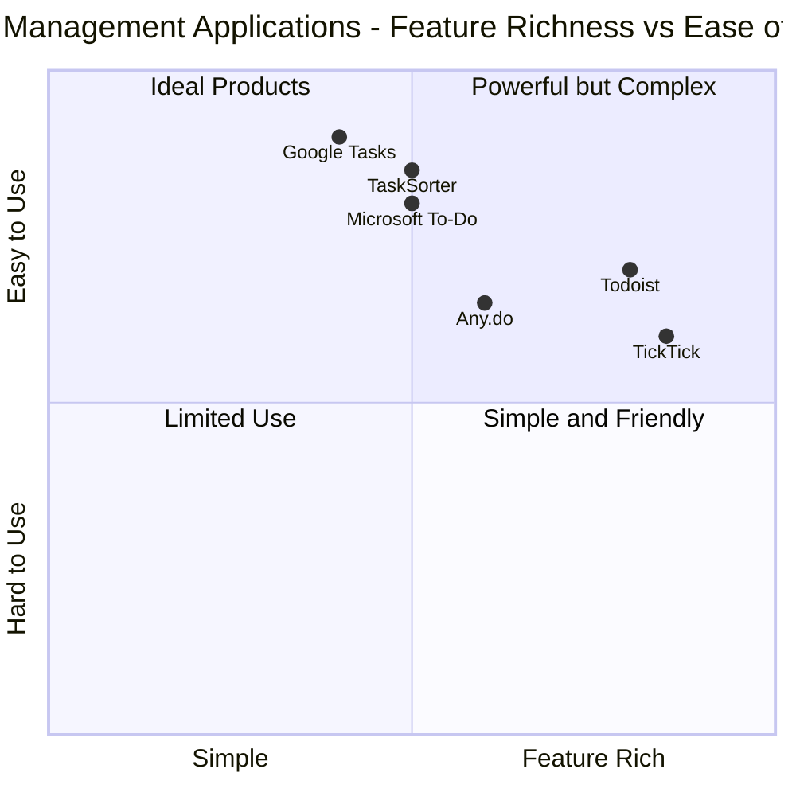

# Product Requirements Document: TaskSorter

## 1. Language & Project Info

- **Language**: English
- **Programming Languages**: React, JavaScript, Tailwind CSS (Frontend), Node.js (Backend)
- **Project Name**: task_sorter
- **Original Requirements**: Create a web application that demonstrates the Strategy design pattern through a task management system where users can create tasks and sort them using different strategies (by date, by priority, alphabetically).

## 2. Product Definition

### 2.1 Product Goals

1. Create an intuitive task management application that clearly demonstrates the Strategy design pattern
2. Provide users with multiple sorting strategies to organize tasks according to different needs
3. Offer a clean and responsive user interface that works across different devices

### 2.2 User Stories

1. As a student, I want to sort my tasks by due date so that I can prioritize assignments with approaching deadlines.
2. As a project manager, I want to sort tasks by priority level so that I can focus on the most critical items first.
3. As a team leader, I want to sort tasks alphabetically so that I can easily find specific tasks by name.
4. As a user, I want to add new tasks with details like title, description, due date, and priority so that I can keep track of my responsibilities.
5. As a user, I want to mark tasks as complete so that I can track my progress.

### 2.3 Competitive Analysis

| Competitor | Pros | Cons |
|------------|------|------|
| **Todoist** | - Clean user interface<br>- Multiple sorting options<br>- Cross-platform availability<br>- Natural language processing | - Limited free tier<br>- Complex for new users<br>- Premium features locked behind paywall |
| **Microsoft To-Do** | - Simple interface<br>- Good integration with Microsoft ecosystem<br>- Smart suggestions | - Limited sorting options<br>- Fewer features compared to competitors<br>- Basic customization |
| **TickTick** | - Comprehensive task management<br>- Multiple views (Kanban, list, etc.)<br>- Calendar integration | - Advanced features require subscription<br>- Can be overwhelming<br>- Learning curve for new users |
| **Google Tasks** | - Integration with Google ecosystem<br>- Clean interface<br>- Simple to use | - Limited sorting functionality<br>- Basic feature set<br>- Minimal customization |
| **Any.do** | - Clean design<br>- Daily planning feature<br>- Cross-platform | - Limited free version<br>- Unintuitive UI elements<br>- Sync issues reported by users |
| **TaskSorter** (Our Product) | - Demonstrates Strategy pattern clearly<br>- Multiple sorting strategies<br>- Clean, focused interface<br>- Open source | - Limited feature set (focused on sorting)<br>- No integration with other services<br>- New in the market |

### 2.4 Competitive Quadrant Chart



## 3. Technical Specifications

### 3.1 Requirements Analysis

The application must implement the Strategy design pattern to manage different task sorting algorithms. This pattern allows the algorithm's selection to be changed at runtime based on user preference. The application should have a clean architecture with clear separation between the UI and the sorting strategies.

The Strategy pattern will be implemented as follows:
- A `SortStrategy` interface that defines a common method for all concrete sorting strategies
- Multiple concrete strategy classes (e.g., `DateSortStrategy`, `PrioritySortStrategy`, `AlphabeticalSortStrategy`)
- A context class (`TaskList`) that uses the selected strategy to perform sorting

The app should store user tasks with proper metadata and provide a responsive interface that works on both desktop and mobile devices.

### 3.2 Requirements Pool

#### P0 (Must-have)

1. User must be able to create new tasks with title, description, due date, and priority level
2. User must be able to view a list of all tasks
3. User must be able to sort tasks using at least 3 different strategies (by date, by priority, alphabetically)
4. User must be able to mark tasks as complete
5. The application must implement the Strategy design pattern for the sorting mechanism
6. The interface must be responsive and work on desktop and mobile devices

#### P1 (Should-have)

1. User should be able to edit existing tasks
2. User should be able to delete tasks
3. User should be able to filter tasks (completed/active)
4. User should be able to see the current sorting strategy visually indicated
5. Tasks should be stored persistently (local storage or database)

#### P2 (Nice-to-have)

1. User may be able to create custom sorting strategies
2. User may be able to categorize tasks with tags or categories
3. User may be able to set recurring tasks
4. Application may include data visualization of task completion
5. Application may have dark mode support

### 3.3 UI Design Draft

The application will feature a clean, minimalist interface with the following components:

#### Main Screen

```
+---------------------------------------------------------------+
|                       TASKSORTER                               |
+---------------------------------------------------------------+
|  [+ New Task]            Sort by: [Date ▼] [Priority] [A-Z]   |
|                          View: [All ▼]                        |
+---------------------------------------------------------------+
|  [ ] High Priority Task                     Due: May 21, 2025  |
|      Description of high priority task...                      |
+---------------------------------------------------------------+
|  [ ] Medium Priority Task                   Due: May 25, 2025  |
|      Description of medium priority task...                    |
+---------------------------------------------------------------+
|  [✓] Completed Task                         Due: May 15, 2025  |
|      Description of completed task...                          |
+---------------------------------------------------------------+
|  [ ] Low Priority Task                      Due: June 5, 2025  |
|      Description of low priority task...                       |
+---------------------------------------------------------------+
```

#### New/Edit Task Dialog

```
+---------------------------------------------------------------+
|                     ADD/EDIT TASK                              |
+---------------------------------------------------------------+
|  Title:       [                                            ]   |
|  Description: [                                            ]   |
|                [                                            ]   |
|                                                               |
|  Due Date:    [MM/DD/YYYY]                                    |
|                                                               |
|  Priority:    ( ) High   ( ) Medium   ( ) Low                 |
|                                                               |
|            [Cancel]                        [Save]             |
+---------------------------------------------------------------+
```

### 3.4 Technical Architecture

The application will implement the Strategy design pattern as follows:

```javascript
// Strategy Interface
interface SortStrategy {
  sort(tasks: Task[]): Task[];
}

// Concrete Strategies
class DateSortStrategy implements SortStrategy {
  sort(tasks: Task[]): Task[] {
    return [...tasks].sort((a, b) => a.dueDate - b.dueDate);
  }
}

class PrioritySortStrategy implements SortStrategy {
  sort(tasks: Task[]): Task[] {
    const priorityValues = { high: 3, medium: 2, low: 1 };
    return [...tasks].sort((a, b) => priorityValues[b.priority] - priorityValues[a.priority]);
  }
}

class AlphabeticalSortStrategy implements SortStrategy {
  sort(tasks: Task[]): Task[] {
    return [...tasks].sort((a, b) => a.title.localeCompare(b.title));
  }
}

// Context
class TaskList {
  private tasks: Task[] = [];
  private sortStrategy: SortStrategy;

  constructor(sortStrategy: SortStrategy) {
    this.sortStrategy = sortStrategy;
  }

  setSortStrategy(sortStrategy: SortStrategy) {
    this.sortStrategy = sortStrategy;
  }

  addTask(task: Task) {
    this.tasks.push(task);
  }

  getSortedTasks(): Task[] {
    return this.sortStrategy.sort(this.tasks);
  }
}
```

### 3.5 Open Questions

1. Should the application support multiple task lists or projects?
2. Is user authentication required for this version?
3. Should the application support collaboration between multiple users?
4. Are there any specific accessibility requirements?
5. Should tasks support attachments or links to external resources?

## 4. Implementation Plan

### 4.1 Frontend Development

- Set up React application with Tailwind CSS
- Create UI components based on the design draft
- Implement the Strategy pattern for sorting mechanisms
- Create forms for adding and editing tasks
- Implement responsive design
- Set up client-side storage (local storage for MVP)

### 4.2 Backend Development

- Set up a simple Node.js server (if needed beyond MVP)
- Create API endpoints for task CRUD operations
- Implement proper data validation
- Set up database connection (MongoDB or similar)

### 4.3 Testing

- Unit tests for sorting strategies
- Integration tests for task management functionality
- UI/UX testing on different devices
- Performance testing for sorting large numbers of tasks

## 5. Success Metrics

- Clear implementation of the Strategy design pattern
- All P0 requirements implemented
- Responsive design working on desktop and mobile devices
- Intuitive UI with high usability score from initial testers
- Code quality and maintainability

## 6. Timeline

- **Week 1**: Requirements finalization and UI design
- **Week 2**: Frontend structure and component development
- **Week 3**: Implementation of Strategy pattern and core functionality
- **Week 4**: Testing, bug fixing, and final delivery

---

This PRD outlines the requirements for TaskSorter, a task management application that demonstrates the Strategy design pattern through its task sorting implementation. The document will guide the development team in creating a clean, functional application that meets the educational objectives while providing real utility to users.