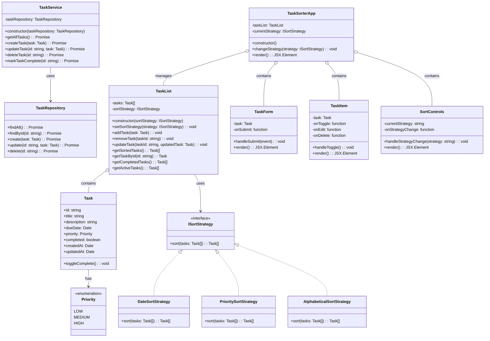
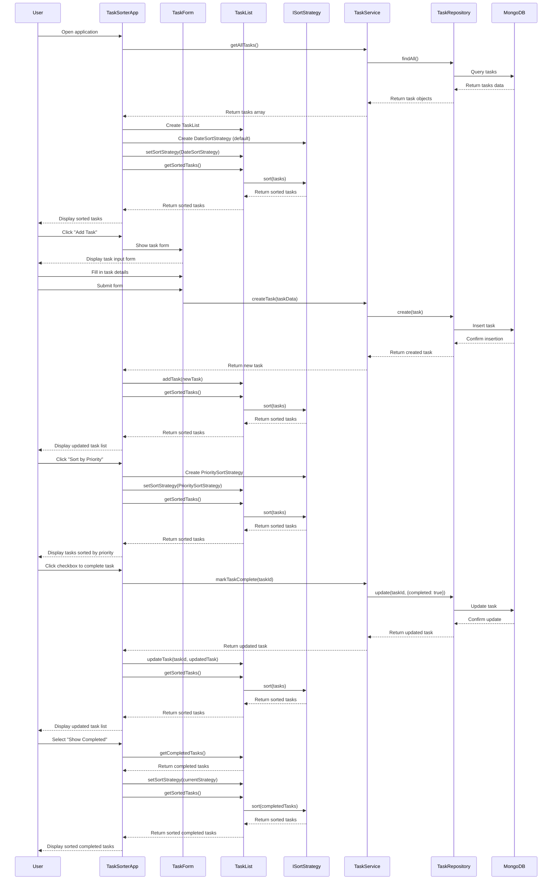

# TaskSorter System Design

## Implementation Approach

For the TaskSorter application, we will create a web-based task management system that clearly demonstrates the Strategy design pattern. The Strategy pattern allows us to define a family of algorithms (sorting strategies), encapsulate each one, and make them interchangeable.

### Technology Stack
- **Frontend**: React with TypeScript, Tailwind CSS
- **Backend**: Node.js with Express
- **Database**: MongoDB for data persistence
- **State Management**: React Context API

### Key Challenges and Solutions

1. **Implementing the Strategy Pattern Effectively**
   - Create a clear interface for all sorting strategies
   - Ensure strategies are truly interchangeable at runtime
   - Make the pattern visible in both frontend and backend implementations

2. **Responsive UI Across Devices**
   - Use Tailwind CSS for responsive design
   - Implement mobile-first approach with adaptive components

3. **Data Persistence**
   - Use MongoDB for scalable storage of tasks
   - Implement local storage as fallback for offline functionality

4. **Performant Sorting with Large Task Lists**
   - Implement efficient sorting algorithms
   - Consider pagination and lazy loading for large datasets

### Open Source Libraries

- **axios** for HTTP requests
- **date-fns** for date manipulation and sorting
- **react-beautiful-dnd** for drag-and-drop functionality
- **mongoose** for MongoDB object modeling
- **jest** for testing

## Data Structures and Interfaces

The core of our application will revolve around the Strategy design pattern for task sorting. Here's the detailed class diagram:

## Program Call Flow

The sequence diagram below demonstrates how the TaskSorter application will handle task creation, retrieval, and sorting using the Strategy pattern:

## Anything UNCLEAR

1. **User Authentication**: The PRD doesn't specify if user authentication is required. For the initial implementation, we assume a single-user system without authentication.

2. **Multiple Task Lists**: It's unclear if users should be able to create multiple separate lists. We've designed the system to support this in the future but focused on a single list for the MVP.

3. **Custom Sorting Strategies**: While listed as a P2 requirement, the implementation details for allowing users to create custom sorting strategies need further clarification. We've designed the system to be easily extensible for this feature in the future.

4. **Offline Functionality**: The extent of offline functionality required is not specified. We've included local storage as a fallback, but detailed offline/online synchronization would need additional specification.

5. **Task Recurrence**: The P2 requirement for recurring tasks would need further specification to determine how the recurrence patterns should be defined and managed.